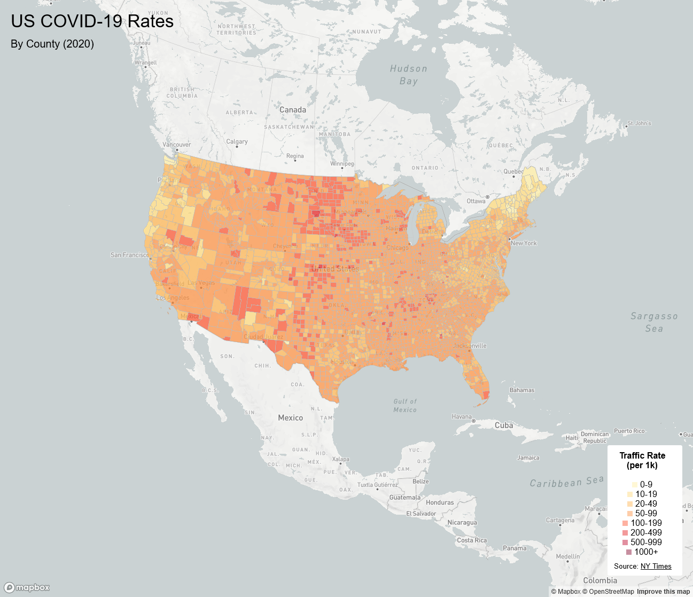
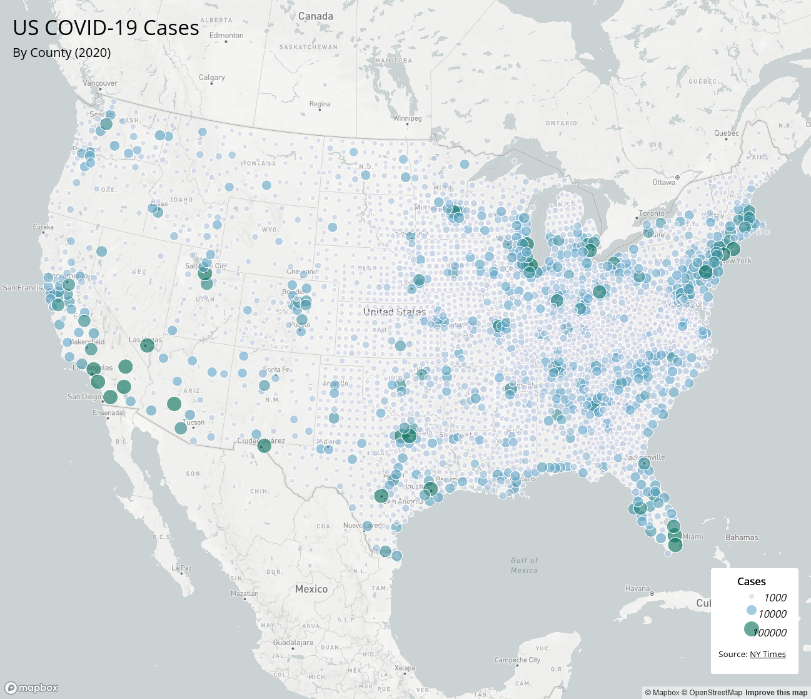

# us-covid19-map Web Map

I did not use AI to write or complete components where AI use is prohibited. I used AI in this assignment for code method explanations and suggestions of minor adjustments.  
In the case where AI was used, I am able to explain my reasoning and process.

# Project Introduction
This project is a detailing of covid-19 cases and rates using JSON data placed onto choropleth/proportional symbols maps.
## Live Maps
* [Map 1: COVID-19 Rates (Choropleth)](https://ocasti-1928405.github.io/us-covid19-map/map1.html)
* [Map 2: COVID-19 Cases (Proportional Symbols)](https://ocasti-1928405.github.io/us-covid19-map/map2.html)

## Screenshots
* Map 1:

* Map 2:

## Primary Functions
**Map 1** Uses color gradients (Choropleth) to visualize the density of cases relative to population.
* **Interactive Popups:** Visitors can click on any county to view specific data (county name, case count, or rate).
* **Thematic Styling:** 
**Map 2** Uses proportional circles to visualize the absolute magnitude of cases.
* **Albers Projection:** Both maps use the Albers projection to preserve the area of US counties, offering an accurate geographical representation.
* **Responsive Design:** The maps are designed to fit full-screen on more than one device.

## Libraries Used
* [Mapbox GL JS](https://docs.mapbox.com/mapbox-gl-js/api/)
* [Google Fonts](https://fonts.google.com/) (Open Sans)
## Data Sources
**COVID-19 Data:** [The New York Times](https://github.com/nytimes/covid-19-data) (2020 cases and deaths).
**Population Data** U.S Census Bureau.
**Shapefiles:** U.S. Census Bureau.
## Credit & Acknowledgements
Map designed by **Oscar Castillo**.
